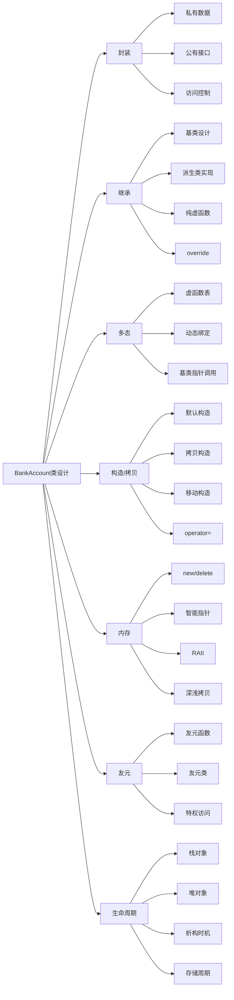

很多朋友和我一样，学了很多C++类的相关知识，学的时候学的很6。可一旦要做点什么，就愣住了，不是去问ai就是直接百度。所以我想做一个可以直接训练所有学过的C++的类的知识的C++银行账户（BankAccount）类，用来实践一下，同时可以回顾我们学习过的C++知识。
# 类的定义
首先我们要定义一个银行账户类，首先我们要确定我们的账户号，持有人姓名，账户余额一定是私有的，这样才能确保用户隐私安全。
```c++
#include <iostream>
#include <string>

class BankAccount{
private:
    std::string accountNumber;          //账户号
    std::string accountHolderName;      //持卡人
    double balance;                     //余额
};
```
## 构造函数
```c++
public:
    BankAccount(const std::string& accnum, const std::string& holderName, double initialBalance)
        : accountNumber(accnum), accountHolderName(holderName), balance(initialBalance) {}
```
首先实现构造函数现接受三个参数分别是账户号（accnum）、账户持有人姓名（holderName）、初始余额（initialBalance）。使用成员初始化列表，将这三个参数分别赋值给类的私有成员变量accountNumber、accountHolderName和balance。

构造函数初始化列表产生的原因是为了高效且正确地初始化成员变量，尤其是const、引用类型或没有默认构造函数的成员。其原理是在对象创建时，成员变量会在构造函数体执行前，通过初始化列表直接完成初始化，避免了先默认构造再赋值的低效过程。常见使用场景包括初始化const成员、引用成员、基类构造、成员对象需要特定参数等，是C++类成员初始化的推荐方式。

